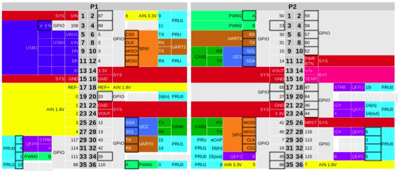

# Computador de bordo BREletrico
Rudivels @Abril 2020

Pasta local  
`/Users/rudi/src/BrEletrica/Can_bus_beagleoard/`

  
# 1. Apresentação 

No BRElétrico o barramento CAN de alta velocidade liga seguintes componentes:

- Controlador do Motor (PM BLDC Guandong); 
- Battery Management System (EK-YT-21-BMS);
- Módulo de gerenciamento de energia;
- Computador de Bordo.

A seguir as especificidades de cada módulo será apresentado e depois o computador será detalhada. 

## 1.1. Controlador do motor (PM BLDC Guandong)
## 1.2. Battery Management System BMS (EK-YT-21-BMS)
## 1.3. Módulo de gerenciamento de energia
Este módulo terá a função de monitorar e gerenciar todo fluxo de energia no veículo elétrico. A partir dos dados transmitidas no barramento CAN este módulo pode registrar o consumo do sistema de tração. O módulo também vai de monitorar e controlar o carregamento das baterias de 12v e 24v. O circuito de 12Volts alimenta todos os sistemas elétricas convencionais no veículo como luzes, buzina, instrumentação e tem como armazenador (por enquanto) uma bateria automotiva chumbo ácido convencional. A previsão é de mudar essa bateria para uma tecnologia mais adequado.
 
Além deste circuito de 12Volts o BRElétrica precisa de um circuito de 24Volts para alimentar o rele de força para ligar o circuto de potência em 200Vdc da bateria de tração ao Controlador do motor de tração. Não se conseguiu resultados satisfatórios e estáveis com reles de 12Vdc, e por isso optou-se em instalar um circuito separado. Num futuro todos os circuitos de potência secundário de um carro elétrico podem ser alimentado por este circuito (por exemplo sistema de arrefecimento do motor e condiciomanento do ar). 

Este módulo tem a função de recarregar as baterias de 12 e 24Volts a partir da rede elétrica convencional. Além disso por meio de um conversor CC-CC esté módulo pode comandar a carga das baterias secundárias a partir do banco de bateria de tração. 
Uma outra opção será de carrgar as baterias secundárias a partir de um  painel de energia solar fotovolaitico no teto do veículo.

O módulo monitorá o consumo das baterias e por meio do barramento CAN informará todos os dados para os demais sistemas e o computador de bordo. Devido a complexidade do módulo ele será implementado num minicomputador compacto Raspberry. A documentação deste módulo está no [repositório](../rasp_can/RASP_CAN_README.md)


# 2. Computador de bordo 

Escolheu-se para o computador de bordo do BRElétrico o minicomputador *Beagle Bone*. A sua escolha se baseou no fato de ter uma arquitetura apropriado para sistemas embarcadas baseado em num ARM, ter além do processador principal, dois *Programmable Real-time Unit (PRU)* que podem ser usados para alguma necessidade de processamento dedicado e dois controladores CAN já incorporados na sua placa.

Há diversas versões do Beagle Bone. Um dos mais populares é o *Beagle Bone Black (BBB)* que foi a primeira versão usado neste desenvolvimento.

BBB tem uma interface HDMI, porta ethernet, porta USB e já vem com Linux embarcada e toda estrutura de software para habilita-lo como servidor com toda funcionalidade TCP-IP internet inerente do Linux. A figura a seguir mostra o diagrama do bloco do computador de bordo com display HDMI no painel do veículo e as redes  CAN ligado aos módulos.  


Entretanto, há uma versão mais nova que foi lançada recentemente que é mais compacto (e barato). O PocketBeagle, tem toda a funcionalidade do BBB, mas diversos conectores físicos dos interfaces da BBB foram retiradas e também foi retidada a interface HDMI. 

Para implementar a proposta foi necessário ligar um transciever CAN para  adequar os sinais cmos do Beagle ao padrão do barramento CAN. Este módulo é alimentado com 3.3V podendo ser diretamente ligado no barramento de expansão do Beagle.

O Beagle funcionará como ponte entre as duas redes CAN e a rede TCP-IP. A partir da rede TCP-IP pode-se ter acesso ao Beagle permitindo a sua monitoração remoto ou re-programação.

A primeira rede Can (Can0) estará ligado aos subsistemas críticos do veículo elétrica, fazendo o monitoramento do banco do bateria, o motor de tração e outros subsistemas que precisam comunicar entre se neste barramento mas rápido. 

A segunda rede (Can1) permitirá a comunicação entre o modulo de medição de velocidade e temperatura, o módulo de sinalização e luzes e demais módulos que não são críticos ao funcionamento do veículo. A comunicação destes útimo barramento pode ter uma velocidade menor que o primeiro.

A implementação deste sistema foi feito com um PocketBeagle e um modulo conversor CAN baseado no transciever SN65HVD230, conforme mostrado na foto a seguir:


## 2.1 Configurando o PocketBealge

O primeiro passo é configurar o hardware do PocketBeagle para a proposta.
O PocketBeagle pode ser accessado na USB pelo comando:
 
`ssh debian@192.168.6.2`  a senha padrão do Beagle é `temppwd` 

Os pinos no barramento de acesso do PocketBeagle podem ser configurados para dar acesso a várias funcionalidades do computador. 

A dificuldade consiste no fato de o Beagle ter um sistemática de mapeamento de hardware no sistema operacional Linux específica, diferente dos computadores convencionais. O Beagle é um computador numa única placa que usa o processador com arquitetura ARM. Por conta dos inúmeros sistemas baseados no arquitetura ARM que surgiram para sistemas embarcadas, houve uma modificação no Kernel do Linux para dar conta a especificidades destes sistemas.

No sistema operacional Linux  convencional as especificidades do hardware são de certa forma incorporadas no Kernel, mas este sistemática se mostrou impraticável com as placas ARM. Por isso foi introduzido a estrutura de Device Tree para que o computador Beagle saiba qual hardware e periféricos estão fisicamente instalados na placa. Veja o artigo de Mateus Gagliardi: Introdução ao uso de Device Tree e Device Tree Overlay em Sistemas Linux Embarcado. 2015. <https://www.embarcados.com.br/device-tree-linux-embarcado/>

No caso do Beagle essa estrutura de Device Tree tem que dar conta para definir quais pinos serão usados do hardware, pois Beagle tem portas genéricas para entrada e saída de dados (GPIO), uma porta analógica (ADC), PWM, UART, SPI e I2C pinos, e estes pinos podem ser configurados para diversos usos. No nosso caso específico, as duas controladoras CAN usam alguns dos pinos da SPI e do I2C como entrada e saída dos sinais CAN. 

Este roteiro é uma adaptação da configuração do BBB no artigo no [https://www.beyondlogic.org/adding-can-to-the-beaglebone-black/](https://www.beyondlogic.org/adding-can-to-the-beaglebone-black/) para o PocketBeagle.

Nos releases dos kernels mais novos a configuração do pinos é melhor documentos. Para ver a versão do kernal pode executar o comando: 

`$ uname --a`

```
Linux beaglebone 4.19.94-ti-r42 #1buster SMP PREEMPT Tue Mar 31 19:38:29 UTC 2020 armv7l GNU/Linux
```

Para verificar se de fato a Can bus está mapeado no kernel pode-se executar o comando 
`$ dmesg | grep can`

A resposta tem que ser algo do tipo: 

```
[    1.047544] c_can_platform 481cc000.can: c_can_platform device registered (regs=5e6dc592, irq=39)
[    1.049113] c_can_platform 481d0000.can: c_can_platform device registered (regs=e2b987c8, irq=40)
[    1.186345] can: controller area network core (rev 20170425 abi 9)
```


O próximo passo é configur qual porta can será usado e quais pinos serão ligado fisicamente no conector de saída. A figura a seguir mostra os conector P2 com as diversas opções dos pinos.



A interface CAN0 pode ser ligado nos pino 26 e 28 do conector P1. Nota-se que a interface CAN1 pode ser ligado nos pinos 9,10 ou 25,27. 

| Beagle  | pino | transciever |  pino |
|:-------:|:----:|:-----------:|:-----:|
| gnd     | 21   | GND         | 2     |
| 3.3v    | 23   | 3V3         | 1     | 
| can1 rx | 25   | CRX         | 4     |
| can1 tx | 27   | CTX         | 3     |


Há um programa de configuração de pinos que permite escolher a funcionalidade do pino e ver seu atual uso.
Por exemplo o seguinte comando lista todas as opções disponíveis para o pino P2.5:
 
`config-pin -l P2.25`

```
Available modes for P2_25 are: default gpio gpio_pu gpio_pd gpio_input spi spi_cs uart can i2c
``` 

Para configurar o pino para acessar a interface can:

`config-pin P2.27 can`

Para finalizar o processe de configuração do hardware temos que iniciar a interface CAN com o seguinte comando: 

` sudo /sbin/ip link set can1 up type can bitrate 500000`

Com isso pode se verificar o status da interface can com os comandos normais de rede do linux que deve mostrar a nova interface can e todos os outros interfaces de comunicação do sistema.

`ifconfig`

Para automatizar o processo de ativação do Can bus no boot ainda falta descobrir como configurar os pinos como interface can durante o boot.  
Pode ser depois usar a mesma sequencia de ativação do can durante o boot usado no Sistema de  Gerenciador de Energia mostrado no [repositório ](../rasp_can/RASP_CAN_README.md) 

Com isso conseguimos resolver a parte mais difícil até o presente momento que foi a configuração do Beagle para ativar os dois controladores CAN, habilitar o hardware de interfaceamento com os transcievers CAN e configurar a porta de comunicação no linux para conversar com os controladores.

## 2.2. Configurando o CAN Bus

O sistema operacional Linux embarcada no BBB já vem com pacote SocketCan ou can-utils de ferramentas para trabalhar com a rede de comunicação CAN. Este pacote de ferramentas e utilitários permite visualizar, registrar e gerar tráfego de dados do barramento CAN, além de permitir acesso ao barramento CAN via IP sockets entre vários outros funcionalidades. <https://github.com/linux-can/can-utils>

Os utiltários candump do SocketCan permite visualizar os dados do barramento de comunicação.


`candump can1`

```
can1  654   [5]  A5 43 AD 6F EC
can1  631   [8]  40 05 30 FF 00 40 00 9E
can1  7FA   [8]  17 86 02 73 02 AA 33 27
can1  5BE   [8]  82 0B B6 4E 96 7A DC 0B
can1  6A3   [7]  55 24 5D 7B A9 DA 7D
can1  4C6   [8]  51 2B A8 44 5F 75 04 11
can1  785   [8]  DE 54 E7 23 46 34 14 3C
can1  631   [8]  40 05 30 FF 00 40 00 9F
can1  7B0   [8]  B0 2B AE 64 84 DE C3 75
can1  5FA   [8]  D6 8E 60 6C 4F FC 1F 17
can1  112   [8]  3B B4 47 28 0C B1 56 15
can1  1D5   [2]  0E 5B
can1  25B   [0] 
can1  631   [8]  40 05 30 FF 00 40 00 A0
can1  677   [8]  A7 63 56 70 3D 3B E4 6B
can1  5B6   [8]  9C B0 E8 7C 3B 35 F0 21
can1  246   [8]  81 69 04 5E F6 61 D2 55
```

Essa sáida foi gerada rodando o utilitário `cangen` no Sistema de Gerenciamenyo de Energia baseado no Raspberry com MC2515 que gera uma sequencia randômica no barramento can.

Há uma vasta documentação técnica sobre o uso do SocketCan em sistemas operacionais Linux acessando a porta CAN a partir de programas desenvolvido em C/C++ ou Python.


# 3. Programação do computador de bordo

Máquina de estado do computador de bordo. 
Monitorando barramento de alta velocidade

- Corrente e tensão do bateria
- Estado do controlador do motor
 
Monitorando barramento de baixa velocidade

- Velocidade, temperatura
- Tensão secundárias

Visualizando dados no display.


Para programação em Python Veja artigo de Bruno Oliveira 2017 - Aplicação rede CAN com BBB e Python <https://www.embarcados.com.br/can-com-beaglebone-black-e-python/>

# Bibliografia
 

4) Ribeiro A do N, Meneghin P, Els RH van. Developing technology for a Brazilian hybrid electric mini car. 2nd Lat. Am. Conf. Sustain. Dev. Energy, Water Environ. Syst., 2020, p. 1–10. 
[link artigo](http://fga.unb.br/rudi.van/galeria/arrigo-alex-lasdewes20-fp-161.pdf)

[Volta](../README.md)
