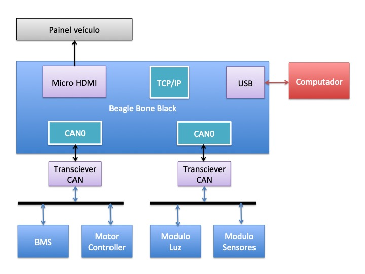

# Computador de bordo BREletrico
Rudivels @Abril 2020

Pasta local  
`/Users/rudi/src/BREletrica/Can_bus_beagleoard/`

  
# 1. Apresentação 

No BRElétrico o barramento CAN de alta velocidade liga seguintes componentes:

- Controlador do Motor (PM BLDC Guandong); 
- Battery Management System (EK-YT-21-BMS);
- Módulo de gerenciamento de energia;
- Computador de Bordo.

A seguir as especificidades de cada módulo será apresentado e depois o computador será detalhada. 

## 1.1. Controlador do motor (PM BLDC Guandong)
## 1.2. Battery Management System BMS (EK-YT-21-BMS)
## 1.3. Módulo de gerenciamento de energia
Este módulo terá a função de monitorar e gerenciar todo fluxo de energia no veículo elétrico. A partir dos dados transmitidas no barramento CAN este módulo pode registrar o consumo do sistema de tração. O módulo também vai de monitorar e controlar o carregamento das baterias de 12v e 24v. O circuito de 12Volts alimenta todos os sistemas elétricas convencionais no veículo como luzes, buzina, instrumentação e tem como armazenador (por enquanto) uma bateria automotiva chumbo ácido convencional. A previsão é de mudar essa bateria para uma tecnologia mais adequado.
 
Além deste circuito de 12Volts o BRElétrica precisa de um circuito de 24Volts para alimentar o rele de força para ligar o circuto de potência em 200Vdc da bateria de tração ao Controlador do motor de tração. Não se conseguiu resultados satisfatórios e estáveis com reles de 12Vdc, e por isso optou-se em instalar um circuito separado. Num futuro todos os circuitos de potência secundário de um carro elétrico podem ser alimentado por este circuito (por exemplo sistema de arrefecimento do motor e condiciomanento do ar). 

Este módulo tem a função de recarregar as baterias de 12 e 24Volts a partir da rede elétrica convencional. Além disso por meio de um conversor CC-CC esté módulo pode comandar a carga das baterias secundárias a partir do banco de bateria de tração. 
Uma outra opção será de carrgar as baterias secundárias a partir de um  painel de energia solar fotovolaitico no teto do veículo.

O módulo monitorá o consumo das baterias e por meio do barramento CAN informará todos os dados para os demais sistemas e o computador de bordo. Devido a complexidade do módulo ele será implementado num minicomputador compacto Raspberry. A documentação deste módulo está no [repositório](../rasp_can/RASP_CAN_README.md)

# 2. Computador de bordo 

Escolheu-se para o computador de bordo do BRElétrico o minicomputador *Beagle Bone Black (BBB)*. A sua escolha se baseou no fato de ter uma arquitetura apropriado para sistemas embarcadas baseado em num ARM, ter além do processador principal, dois *Programmable Real-time Unit (PRU)* que podem ser usados para alguma necessidade de processamento dedicado e dois controladores CAN já incorporados na sua placa.

Além disso o BBB tem uma interface HDMI, porta ethernet, porta USB e já vem com Linux embarcada e toda estrutura de software para habilita-lo como servidor com toda funcionalidade TCP-IP internet inerente do Linux. A figura a seguir mostra o diagrama do bloco do computador de bordo com display HDMI no painel do veículo e as redes  CAN ligado aos módulos.  

O transciever CAN é um módulo da SN65HVD230 que adequa os sinais cmos do BBB ao padrão do barramento CAN. Este módulo é alimentado com 3.3V podendo ser diretamente ligado no barramento de expansão do BBB.

O BBB funcionará como ponte entre as duas redes CAN e a rede TCP-IP. A partir da rede TCP-IP pode-se ter acesso ao BBB permitindo a sua monitoração remoto ou re-programação.

A primeira rede Can (Can0) estará ligado aos subsistemas críticos do veículo elétrica, fazendo o monitoramento do banco do bateria, o motor de tração e outros subsistemas que precisam comunicar entre se neste barramento mas rápido. 

A segunda rede (Can1) permitirá a comunicação entre o modulo de medição de velocidade e temperatura, o módulo de sinalização e luzes e demais módulos que não são críticos ao funcionamento do veículo. A comunicação destes útimo barramento pode ter uma velocidade menor que o primeiro.

## 2.1. Configurando o CAN Bus

O sistema operacional Linux embarcada no BBB já vem com pacote SocketCan ou can-utils de ferramentas para trabalhar com a rede de comunicação CAN. Este pacote de ferramentas e utilitários permite visualizar, registrar e gerar tráfego de dados do barramento CAN, além de permitir acesso ao barramento CAN via IP sockets entre vários outros funcionalidades. <https://github.com/linux-can/can-utils>

Os utiltários candump do SocketCan permite visualizar os dados do barramento de comunicação, mas também é possível acessar a porta can a partir de programas desenvolvido em C/C++ ou Python.

Há uma vasta documentação técnica sobre o uso do SocketCan em sistemas operacionais Linux, mas a parte mais difícil até o presente momento tem sido a configuração do BBB para ativar os dois controladores CAN, habilitar o hardware de interfaceamento com os transcievers CAN e configurar a porta de comunicação no linux para conversar com os controladores.

A dificuldade consiste no fato de o BBB ter um sistemática de mapeamento de hardware no sistema operacional Linux específica, diferente dos computadores convencionais. O BBB é um computador numa única placa que usa o processador com arquitetura ARM. Por conta dos inúmeros sistemas baseados no arquitetura ARM que surgiram para sistemas embarcadas, houve uma modificação no Kernel do Linux para dar conta a especificidades destes sistemas.

No sistema operacional Linux  convencional as especificidades do hardware são de certa forma incorporadas no Kernel, mas este sistemática se mostrou impraticável com as placas ARM. Por isso foi introduzido a estrutura de Device Tree para que o computador (BBB) saiba qual hardware e periféricos estão fisicamente instalados na placa. Veja o artigo de Mateus Gagliardi: Introdução ao uso de Device Tree e Device Tree Overlay em Sistemas Linux Embarcado. 2015. <https://www.embarcados.com.br/device-tree-linux-embarcado/>

No caso do BBB essa estrutura de Device Tree tem que dar conta para definir quais pinos serão usados do hardware, pois BBB tem portas genéricas para entrada e saída de dados (GPIO), uma porta analógica (ADC), PWM, UART, SPI e I2C pinos, e estes pinos podem ser configurados para diversos usos. No nosso caso específico, as duas controladoras CAN usam alguns dos pinos da UART e do I2C como entrada e saída dos sinais CAN. 

 

Veja artigo de Bruno Oliveira 2017 - Aplicação rede CAN com BBB e Python <https://www.embarcados.com.br/can-com-beaglebone-black-e-python/>

# Bibliografia
 

4) Ribeiro A do N, Meneghin P, Els RH van. Developing technology for a Brazilian hybrid electric mini car. 2nd Lat. Am. Conf. Sustain. Dev. Energy, Water Environ. Syst., 2020, p. 1–10. 
[link artigo](http://fga.unb.br/rudi.van/galeria/arrigo-alex-lasdewes20-fp-161.pdf)


