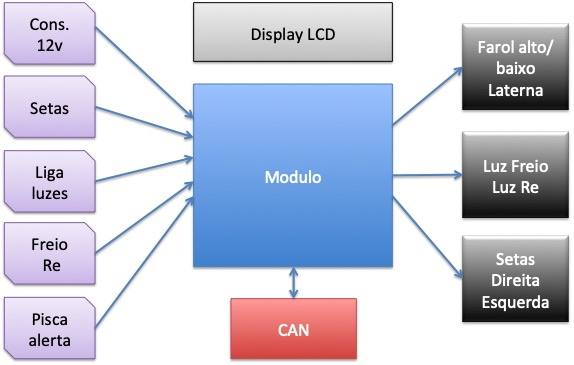
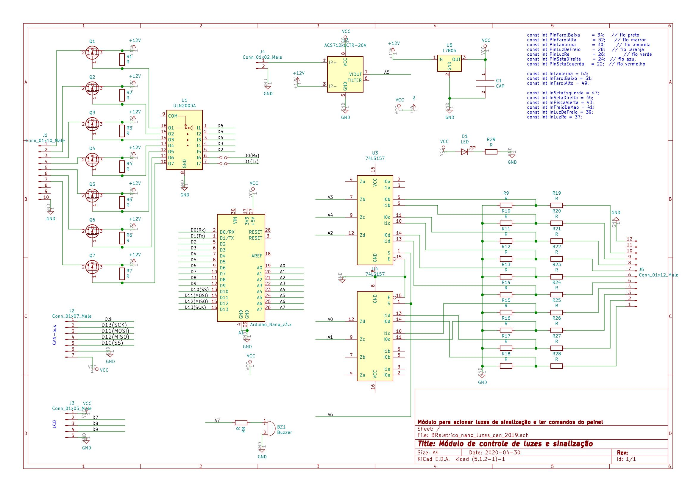
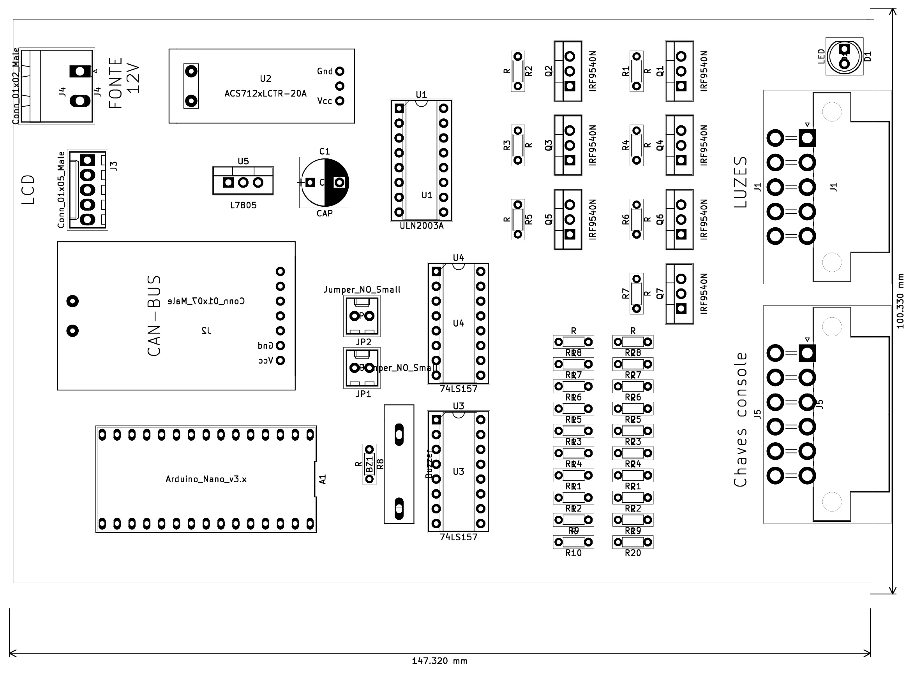
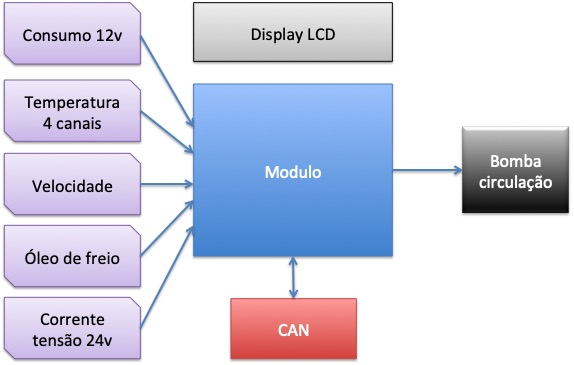
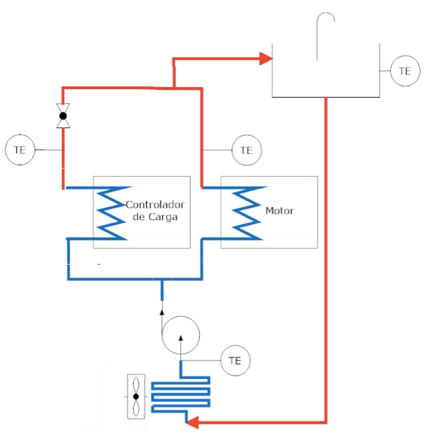
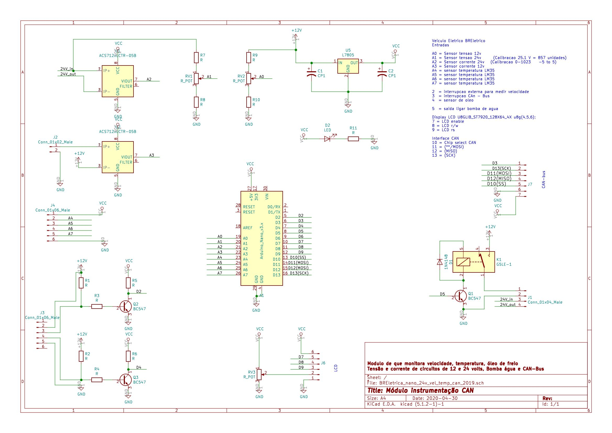
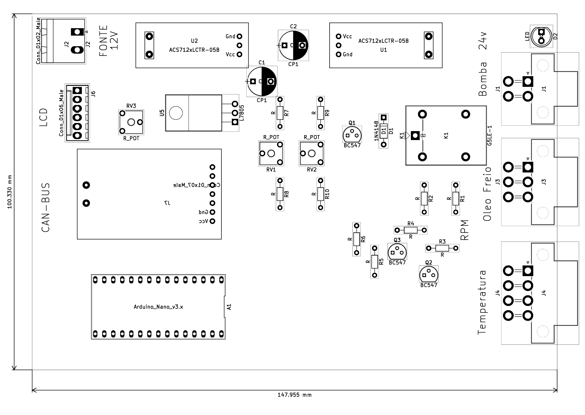

# Módulos de instrumentação e comando
Rudivels @Abril 2020

Pasta local  
`/Users/rudi/src/BrEletrica/MODULOS_arduino_can/`

# 1. Barramento de baixa velocidade

O barramento CAN de baixa velocidade interliga:

- Módulo de controle de luzes e sinalização;
- Módulo de monitoramento de velocidade, temperatura e óleo de freio;
- Computador de Bordo.

# 2. Módulo de controle de luzes e sinalização

O BR800 é um carro fabricada na década de 1980 com um sistema de controle de luzes e sinalização convencional baseado em relés e interruptores simples. A conversão do BR800 para elétrica, também teve que fazer o *redesing* das instalações elétricas do veículo, incorporando toda parte de sinalização e luzes à barramento de comunicação do novo veículo.
 
Um novo módulo foi desenhado para centralizar todos os comandos de luzes e sinalização, aproveitando as teclas e interruptores já existentes no *dashboard* do veículo, mas permitido a sua expansão com elementos não convencionais que podem ser facilmente incorporado na nova configuração tecnológica.

   

Este módulo tem como elemento central o Arduino Nano. Escolheu-se esta placa microcontroladora por sua popularidade, grande acervo técnico de suporte e relação custo benefício. 
O módulo monitora as teclas no painel para ligar a sinalização (setas direita e esquera), farois (baixo e alto), lanterna, luz de freio, pisca alerta, freio de mão, e luz de ré no total de 9 comandos.

Estes comandos são processados pelo módulo e apresentado de forma gráfico no display do módulo e por meio de 7 comandos os sinais luminosos farol alto, farol baixa, lanterna, luz de freio, luz de ré e as setas para direita e esquerda são acionados. A sinalização de freio de mão acionada e encaminhada somente para o display. 
As figuras a seguir mostram o esquema elétrica do módulo e a placa de circuito impresso. (falta trimpot de luminosidade do lcd).

Falta trocar o D2 com D3 do Arduino para mantar a compatibilidade da biblioteca CAN do sparkfun can-shield.

O módulo será alojado numa caixa padrão Patola [PB115](http://www.patola.com.br/index.php?route=product/product&product_id=359) com conectores específicos para cada funcionalidade, com pinagem diferenciados para evitar trocas. Os conectores para display, alimentação 12 volts, CAN também são padronizadas. 

O módulo tem a capacidade de monitorar seu consumo de corrente e a sua tensão e o barramento CAN permitirá a medição e acionamento remoto.
A comunicação CAN é implementado por um controlador dedicada para CAN Bus MCP2515 que está ligado por meio da interface SPI ao microcontrolador Arduino. Veja o datasheet do controlador MCP2515 
[aqui](http://ww1.microchip.com/downloads/en/DeviceDoc/MCP2515-Stand-Alone-CAN-Controller-with-SPI-20001801J.pdf). 

Os demais componentes do módulo são todos circuitos integrados convencionais, com destaque para o sensor de corrente ACS712.

# 3. Modulo de sensores de velocidade, temperatura e óleo de freio

O BR800 tem um sensor de velocidade acoplada na roda dianteira e um sensor de nível de óleo de freio que foram incorporados no novo design de instrumentação do veículo. Além disso, o novo projeto deve monitorar a temperatura da água no circuito de arrefecimento do motor e controlador e comandar a bomda de circulação de água. O diagrama de blocos mostra as entradas e saídas deste novo modulo de instrumentação.

O circuito de arrefecimento aproveita o radiador original do veículo adaptada para a nova configuração. O diagrama blocos a seguir mostra o circuito.

Este módulo tem por função monitorar a velocidade da roda por meio de um sensor magnética acoplado na roda do veículo. Este sensor fornece um trêm de pulsos proporcional à velocidade de roda. O sensor de óleo de freio é um contato aberto montado na tampa do reservatório de óleo e também é monitorado em intervalos regulares. O módulo monitora 4 sensores de temperatura analógicos LM35 que estão insatalados no circuito de arrefecimento do motor elétrico e seu controlador. A partir da informação da temperatura o módulo comanda o ligamento da bomba circulação de água deste circuito. (pesquisar a opção de alimentar a bomba com 24Volts)

 
O módulo monitora ainda a tensão e corrente da sua própria alimentação 12 Volts, e também monitora a corrente e tensão do circuito de 24Volts.  
Da mesma forma do módulo anterior, escolheu-se implementar este módulo usando Arduino e as figuras a seguir mostram o esquema eletrônico e a placa de circuito impresso.

O módulo também será alojado numa caixa padrão Patola PB115 com conectores específicos para cada funcionalidade, com pinagem diferenciados para evitar trocas. Os conectores para display, alimentação 12 volts, CAN também são padronizadas. 
Da mesma forma que o módulo anterior a comuicação usa o MCP2515 que está ligado por meio da interface SPI ao microcontrolador Arduino.
Os demais componentes do módulo são todos componentes discretos e há dois sensores de corrente ACS712 para monitorar o consumo do módulo.  


## Anotações

Atualizar algus detalhes nas placas:

- Alimentação 24V no rele da bomba
- Padronizar os trimpots de luminosidade no LCD

# Bibliografia
 

1) Vieira MVB, Els RH van, Khalil SB. Avaliação de um veículo a combustão interna convertido para tração elétrica. Congr. iniciação científica Univ. Brasília, 2015, p. 1–9. 
[link para artigo](http://fga.unb.br/rudi.van/galeria/artigo-marcus-vieira-pibic-relatorio-final-envio-2015-08-08-00.pdf). 

2) Els PPD van, Veiga IVA, Freitas RCM de, Els RH van, Viana DM. Conversão de BR800 e dimensionamento do sistema de arrefecimento. Congr. do 13 salão Latino-Americano Veículos Híbridos-Elétricos, São Paulo-SP: 2017.
[link para artigo](http://fga.unb.br/rudi.van/galeria/pedro-paulo-dunice-van-els.pdf)

3) Freitas RCM de, Veiga IVA, Miranda ARS de, Pedro Paulo Dunice van Els, Els RH van, Viana DM. Plataforma de ensaio para conversão de veículos elétricos com motor de imã permanente sem escovas e banco de baterias. Congr. do 13 salão Latino-Americano Veículos Híbridos-Elétricos, São Paulo-SP: 2017.
[link para artigo](http://fga.unb.br/rudi.van/galeria/renata-cunha-moraes-freitas2.pdf)

4) Ribeiro A do N, Meneghin P, Els RH van. Developing technology for a Brazilian hybrid electric mini car. 2nd Lat. Am. Conf. Sustain. Dev. Energy, Water Environ. Syst., 2020, p. 1–10. 
[link artigo](http://fga.unb.br/rudi.van/galeria/arrigo-alex-lasdewes20-fp-161.pdf)

[volta](../README.md)
