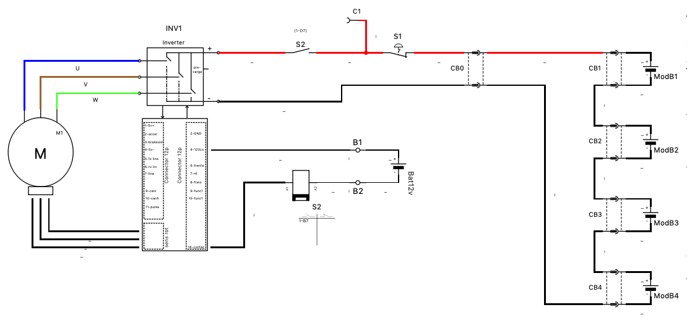
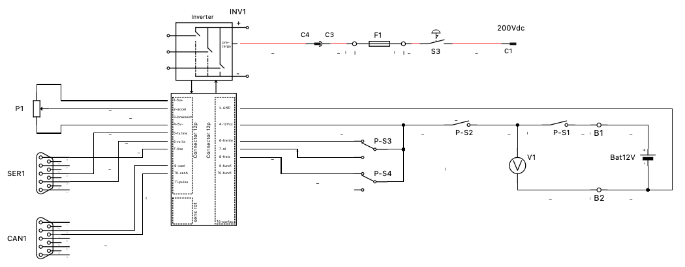
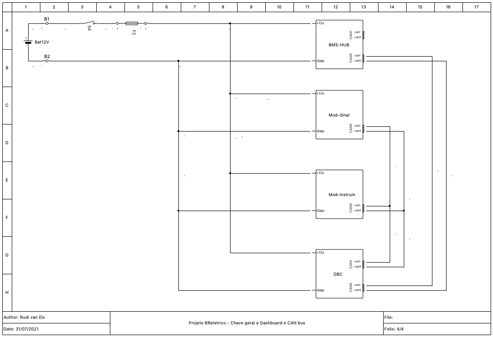
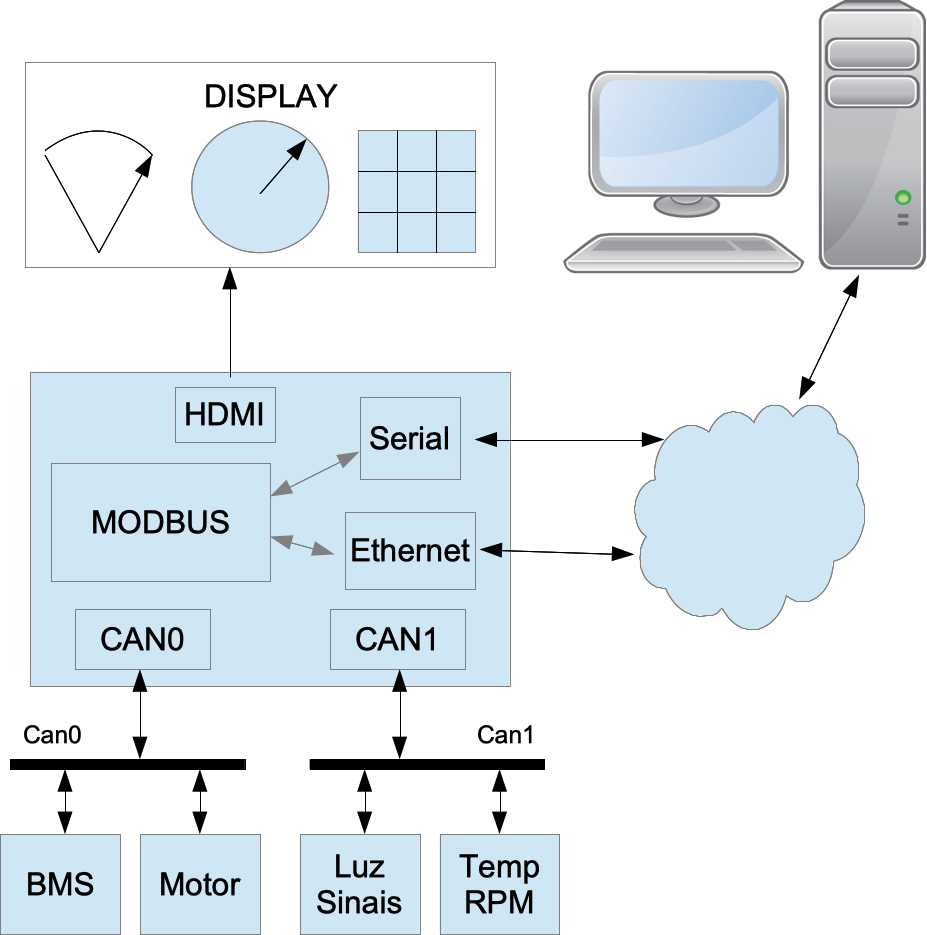
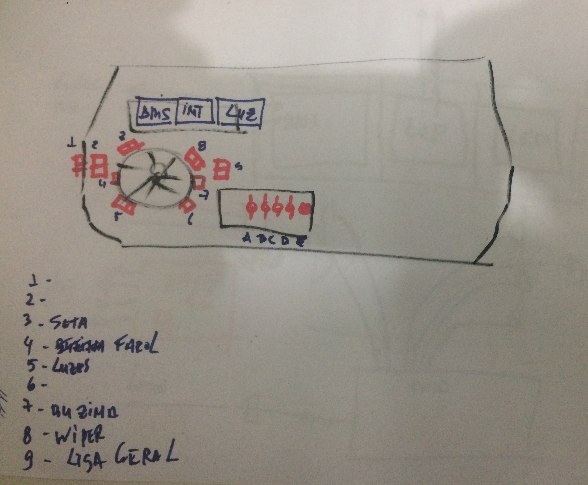
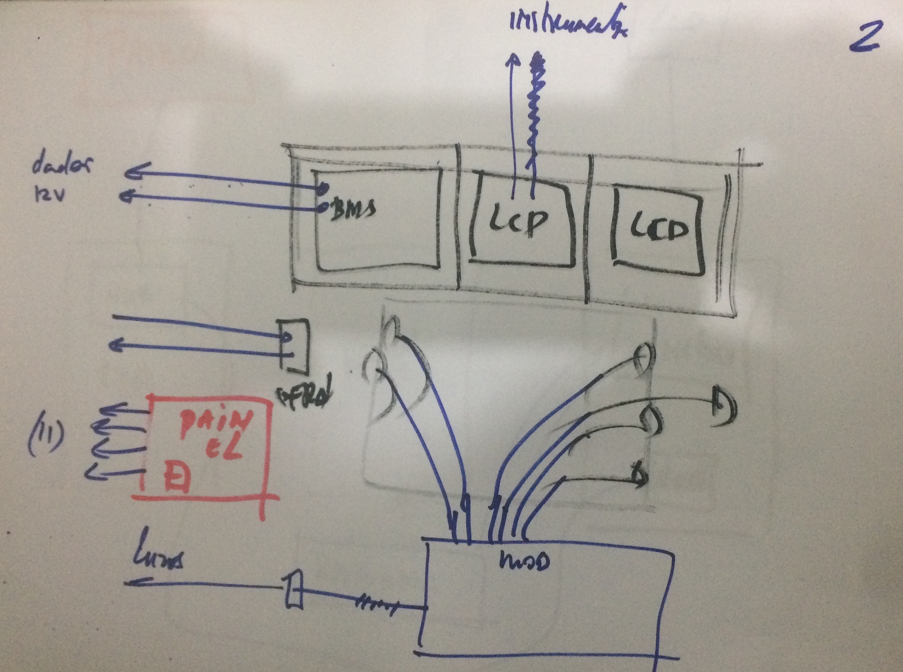
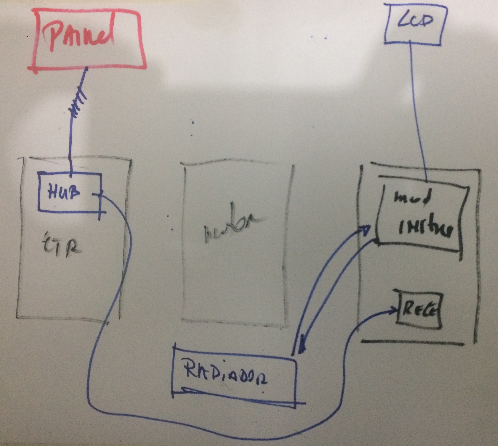
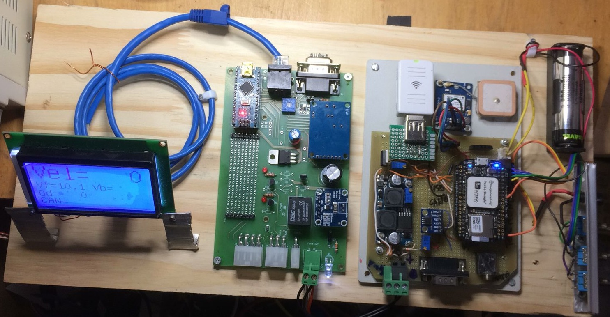

# Conversão do BR800 para o BRElétrico
Rudivels @Abril 2020

Pasta local  
`/Users/rudi/src/BrEletrica/`

[Link para o video com a conversão do veículo](https://youtu.be/-nJ4Txo5IV8)

O Gurgel BR800 foi projetado pelo Gurgel Motores na década de setenta com uma proposta inovadora de ser um veículo leve, pequeno, acessível, ou seja, o primeiro carro popular brasileiro. 
Estes caractersíticas tornam-o apropriadao para ser convertido para tração elétrica. 

Entretanto, a proposta de transformação do BR800 não se resumo somente a trocar a máquina de tração, mas tem como proposta desenvolver tecnologias para a eletrificação do setor de transportes. Neste sentido os princípios que nortearam a transforção são:

- O carro será usado como laboratório com acesso fácil a todos os novos componentes;
- Instalação de instrumentação em todos os pontos de interesse para ter o máximo de dados;
- Tecnologia livre: código fonte aberta e também hardware não proprietário;

A primeira conversão foi realizado com o BR800 instalada no dinamômetro trocando o motor de combustão por motor elétrico [1]. Em seguido um banco de baterias foi instalada e o sistema de arrefecimento do motor e seu controlador. Este sistema de arrefecimento foi desenhada de tal forma que facilite o acesso aos componentes e sua instrumentação [2]. O banco de baterias também foi organizado em módulos para faciliar o acesso e manuseio [3]. 

# 1. Instalação do motor, controlador e banco de bateria

A figura a seguir mostra o diagrama elétrica da parte de potência interligando o motor com o controlador e o banco de baterias.

Os desenhos elétricos feito com qelectrotech estão na pasta local:

`/Users/rudi/Documentos/Qelect/Proj_Breletrico.qet`

A primeira figura é a cabeação de potência entre o banco de baterias, o controlador do motor e o motor elétrico.

O detalhamento do cabeamento de controle do inversor é apresentado na figura a seguir.

A segunda etapa da conversão é o redesenho de toda parte elétrica convencional do carro, como por exemplo, farois, luzes e demais assessórias num barramento usando tecnologia de rede local automotiva mais moderna. 

O BR800 foi desenvolido na década de oitenta e naquela época o sistema elétrico do veículo era realizado com relés e interruptores. Dessa forma é necessária desenhar um novo arranjo da instalação elétrica do carro, levando em conta a necessidade de instrumentação e monitoramento, segurança, e eficiência energética. 

A estratégia será de organizar a parte elétrica em diversos subsistemas inteligentes que conversarão entre si por meio de uma rede de comunicação. Essa rede de comunicação será baseada na tecnologia *Control Area Network (CAN)*, e a seguir serão descritos os diversos subsistemas e sua funcionalidade. 

# 2. Subsistemas

Os veículos modernos usam diversos subsistemas específicos para controlar as diversas funcionalidades do carro e estes subsistemas comunicam uns com os outros usando o barramento de comunicação. Os principais subsistemas são:

- Subsistema de tração e freio;
- Subsistema de armazenamento de energia;
- Subsistema de instrumentação e sinalização;
- Subsistema de portas, vidros e demais assessórios.

## 2.1. Subsistema de instrumentação e sinalização 

Há dois barramentos de comunicação no veículo. O primeiro é um barramento *Control Area Network (CAN)* de alto velocidade que estabelece a comunicação entre os subsistemas críticos como tração e armazenamento. A comunicação entre os demais subsistemas é realizado por um barramento CAN de baixa velocidade. O subsistema de instrumentação também funcionará como ponte entre os dois barramentos.

## 2.2. Módulos

A figura a seguir mostra a ligação dos diversos módulos com o computador de bordo e o BMS.

O diagrama de blocos a seguir mostra os componentes e os dois barramentos CAN.

Assim o subsistema de tração do veículo, composto pelo motor elétrico e o seu controlador recebe os comandos de velocidade e direção do condutor e disponibiliza todos os dados como rotação do motor, tensão e corrente do motor, temperatura do controlador etc, no barramento CAN de alta velocidade.

Da mesma forma o sistema de armazenamento de energia composto pelas baterias, o *Battery Management System (BMS)*, também disponibiliza os dados pelo barramento CAN de alta velocidade. 

O subsistema de sinalização, luzes e monitoramento de temperatura e velocidade estão interligados no barramento CAN de baixa velocidade.

O computador de bordo funcionará como ponte entre as duas barramentos e também apresentará os dados do funcionamento do veículo por meio de uma interface interativa.

[Descrição do projeto do Computador de bordo](https://github.com/Tecnomobele-FGA/Computador-de-bordo)

[Descrição do projeto do Módulo de luzes - sinalização ](https://github.com/Tecnomobele-FGA/Modulo-luzes)

[Descrição do projeto do modulo de instrumentação](https://github.com/Tecnomobele-FGA/Modulo-instrumentacao)

[Descrição do projeto do sistema de gerenciamento de energia](https://github.com/Tecnomobele-FGA/Sistema-gerenciamento-energia)

A implementação dos subsistemas está nos seguintes diretórios.

[Implementacao do módulo de luzes - sinalização ](https://github.com/rudivels/BREletrica_Luzes_CAN_beep_display)

[Impplementacao do módulo de instrumentação](https://github.com/rudivels/BREletrica_Sensor_CAN_Lcd_Velocidade_temperatura)

# 3. Cabeamento e painel (dashboard)

Proposta de cabeação do painel e do hub no compartimento do motor.
A figura a seguir mostra uma proposta de disposição do painel com o módulo de sinalização. A proposta é ter toda a cabeação no painel e com alguns conectores de fácil (des)montagem.  

Visão interna do painel com detalhamento da cabeação

No berço do motor há a necessidade de um hub de cabeação para ligar os comandos do motor, o módulo de instrumentação e o conector painel (dashboard)

# 4. Integração dos sistemas

Bancada de teste

# 5. Bibliografia
 

1) Vieira MVB, Els RH van, Khalil SB. Avaliação de um veículo a combustão interna convertido para tração elétrica. Congr. iniciação científica Univ. Brasília, 2015, p. 1–9. 
[link para artigo](http://fga.unb.br/rudi.van/galeria/artigo-marcus-vieira-pibic-relatorio-final-envio-2015-08-08-00.pdf). 

2) Els PPD van, Veiga IVA, Freitas RCM de, Els RH van, Viana DM. Conversão de BR800 e dimensionamento do sistema de arrefecimento. Congr. do 13 salão Latino-Americano Veículos Híbridos-Elétricos, São Paulo-SP: 2017.
[link para artigo](http://fga.unb.br/rudi.van/galeria/pedro-paulo-dunice-van-els.pdf)

3) Freitas RCM de, Veiga IVA, Miranda ARS de, Pedro Paulo Dunice van Els, Els RH van, Viana DM. Plataforma de ensaio para conversão de veículos elétricos com motor de imã permanente sem escovas e banco de baterias. Congr. do 13 salão Latino-Americano Veículos Híbridos-Elétricos, São Paulo-SP: 2017.
[link para artigo](http://fga.unb.br/rudi.van/galeria/renata-cunha-moraes-freitas2.pdf)

4) Ribeiro A do N, Meneghin P, Els RH van. Developing technology for a Brazilian hybrid electric mini car. 2nd Lat. Am. Conf. Sustain. Dev. Energy, Water Environ. Syst., 2020, p. 1–10. 
[link artigo](http://fga.unb.br/rudi.van/galeria/arrigo-alex-lasdewes20-fp-161.pdf)

5) Costa MDO, Els RH van, Khalil SB. Projeto de platafoma de análise de conversão de tração de veículos com motor a combustão interna para tração elétrica. 10o Salão e Congr. Latino-Americano Veículos Elétricos, São Paulo: 2014.
[link artigo](http://fga.unb.br/rudi.van/galeria/costa-els-projeto-de-plataforma-de-veiculo-eletrico.pdf)

Abri para mais usuarios
