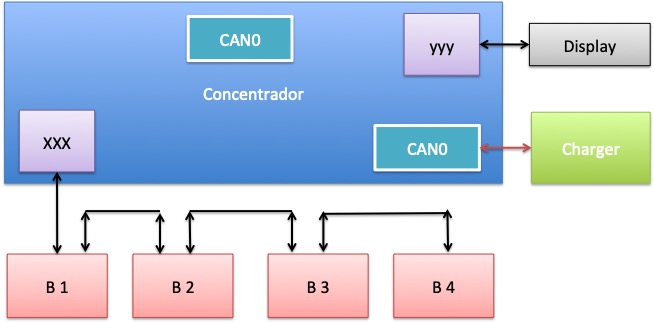

# Barramento CAN de Alta Velocidade
Rudivels @Abril 2020

Pasta local  
`/Users/rudi/src/BrEletrica/Barramento_Alta_Can/`

  
# 1. Apresentação 

No BRElétrico o barramento CAN de alta velocidade liga seguintes componentes:

- Controlador do Motor (PM BLDC Guandong); 
- Battery Management System (EK-YT-21-BMS);
- Módulo de gerenciamento de energia;
- Computador de Bordo.

A seguir as especificidades de cada módulo será apresentado.


# 2. Módulo de gerenciamento de energia
Este módulo terá a função de monitorar e gerenciar todo fluxo de energia no veículo elétrico. A partir dos dados transmitidas no barramento CAN este módulo pode registrar o consumo do sistema de tração. O módulo também vai de monitorar e controlar o carregamento das baterias de 12v e 24v. O circuito de 12Volts alimenta todos os sistemas elétricas convencionais no veículo como luzes, buzina, instrumentação e tem como armazenador (por enquanto) uma bateria automotiva chumbo ácido convencional. A previsão é de mudar essa bateria para uma tecnologia mais adequado.
 
Além deste circuito de 12Volts o BRElétrica precisa de um circuito de 24Volts para alimentar o rele de força para ligar o circuto de potência em 200Vdc da bateria de tração ao Controlador do motor de tração. Não se conseguiu resultados satisfatórios e estáveis com reles de 12Vdc, e por isso optou-se em instalar um circuito separado. Num futuro todos os circuitos de potência secundário de um carro elétrico podem ser alimentado por este circuito (por exemplo sistema de arrefecimento do motor e condiciomanento do ar). 

Este módulo tem a função de recarregar as baterias de 12 e 24Volts a partir da rede elétrica convencional. Além disso por meio de um conversor CC-CC esté módulo pode comandar a carga das baterias secundárias a partir do banco de bateria de tração. 
Uma outra opção será de carrgar as baterias secundárias a partir de um  painel de energia solar fotovolaitico no teto do veículo.

O módulo monitorá o consumo das baterias e por meio do barramento CAN informará todos os dados para os demais sistemas e o computador de bordo. Devido a complexidade do módulo ele será implementado num minicomputador compacto Raspberry. A documentação deste módulo está no [repositório](../rasp_can/RASP_CAN_README.md)


# 3. Controlador do motor (PM BLDC Guandong)

Descrição do controlador do motor.

Instrument: the CAN bus communication specification
1. Communication specifications
The data link layer principles should be followed
Bus rate: 250kbps
For the data link layer regulations, please reference the relevant regulations of the CAN2.0 B and J1939.
Each component of the CAN bus has a terminal resistor (120 ohms).
All nodes of the CAN bus are light-coupler isolation, and all the bus driver chips are the PHILIPS 82C250.
Sending cycle 40ms, 2 frames, each frame 20ms.
Use CAN expand frame 29th identifier
The first frame ID code is 0x10 08 8A 9E. Data is as follows:

DATA

| LOCATION  | DATA  NAME  | Explain |
|-----------|-------------|---------|
| BYTE1 | voltage low byte	  |0.1V/bit offset：-10000 range：0 V～500V |
| BYTE2 |	voltage high byte  | 
| BYTE3 |	current low byte   | 0.1A/bit offset：-10000； current range：-500A～500A
| BYTE4 |	current high byte  | 	
| BYTE5 |	controller temperature | 	1℃/bit  offset：40℃ limits：0℃～100℃
| BYTE6 |	running state	        | See attachment
| BYTE7 |	fault code low byte	 | See attachment
| BYTE8 |	fault code high byte |	

Running status explanation:

| BIT7 | BIT6 | BIT5 |	BIT4 |	BIT3 |	BIT2 | BIT1 | BIT0 |
|------|------|------|------|------|-----|------|------|
|reserved|Ready for|reserved|reserved|stop|brake|backward|forward|

Fault code instructions: below are the low bytes, no meaning for the high bytes now.

| BIT7 | BIT6 | BIT5 |	BIT4 |	BIT3 |	BIT2 | BIT1 | BIT0 |
|------|------|------|------|------|-----|------|------|
| 0|ERR7|ERR6|ERR5|ERR4|ERR3|ERR2|ERR1|
|75 ℃	|BMS|Over speed|Over heating|Over voltage|Under voltage|Over current|IGBT|

```
ID: 63C, Data: 80 00 00 00 00 00 00 00 
ID: 63C, Data: 80 00 28 00 00 00 00 00 
ID: 63C, Data: 80 C0 01 90 C8 00 00 00 
ID: 63C, Data: 80 00 00 00 00 00 0 0 
ID: 63C, Data: 80 00 28 00 00 00 0 0 
```

```
The second frame ID code is 0x10098A9E. Data is as follows:
DATA
LOCATION	DATA NAME	explain
BYTE1	motor speed low byte	1rpm 
offset： 0  
range：0 ～10000
BYTE2	motor speed high byte	
BYTE3	mileage low byte	0.1	kilometer
offset：0；
range：0～30000
BYTE4	mileage high byte	
BYTE5	motor torque low byte	0.1NM
offset：-10000 
range：-1000～1000
BYTE6	motor torque high byte	
BYTE7	reserved	
BYTE8	reserved	
``




dados medidos com arduino e can shield  15/02/2018

```
CAN e

CAN Init ok

CAN Read - Testing receival of CAN Bus message

CAN Init ok

```
ID: 63C, Data: 80 00 00 00 00 00 0 0 
ID: 63C, Data: 80 00 28 00 00 00 0 0 
ID: 63C, Data: 80 C0 01 90 C8 00 0 0 
ID: 63C, Data: 80 00 00 00 00 00 0 0 
ID: 63C, Data: 80 00 28 00 00 00 0 0 
ID: 63C, Data: 80 00 00 00 00 00 0 0 
```


# 4. Battery Management System BMS (EK-YT-21-BMS)

Descrição do BMS.




Com o osciloscópio mediu-se o sinal no barramento CAN e descobriu-se que a velocidade de comunicação do barramento era de 250khz. 
Funcionamento do Modulo concentrador de comunicação.
Sistema composto por 4 modulos de 16 celular LIFEPO4, ligado por meio de uma barramento próprio, passando alimentação e sinais para o modulo concentrador. Este modulo concentrador tem duas portas CAN. Uma porta para  o Battery Charger e outro avulso. 

Foi feito o teste no 14/05/2020 com Arduino e Can sheild da sparkfun. 
Ligou somente um modulo de batterias (tensão +-40 volts) e o display do BMS. 
Sem ligar o sparkfun o barramento mostra uma atividade muito intensa no osciloscópio. Assim que coloca o sparkfun, no barramento aparece somente vem um pacote de dados a cada 2 segundos.

Usou programa 
`CAN Read Demo for the SparkFun CAN Bus Shield.`
Da biblioteca de CAN do Arduino Shield. Somente configurou o programa para 250khz e a porta serial 57200 bps. 


Quando liga o concentrador somente com um modulo e o display e o Arduino CAN Shield.  

Primeiro teste arduino 

```
CAN Read - Testing receival of CAN Bus message
CAN Init ok
ID: 601, Data: 89 99 00 0F 01 00 00 00 
ID: 33C, Data: 80 00 00 00 00 00 00 00 
ID: 601, Data: 89 99 00 0F 01 00 00 00 
ID: 33C, Data: 80 00 00 00 00 00 00 00 
ID: 601, Data: 89 99 00 0F 01 00 00 00 
ID: 33C, Data: 80 00 00 00 00 00 00 00 
ID: 601, Data: 89 99 00 0F 01 00 00 00 

```

Quarta teste

```
CAN Read - Testing receival of CAN Bus message
CAN Init ok
ID: 601, Data: 89 99 00 0F 00 00 00 00 
ID: 33C, Data: 80 00 00 00 00 00 00 00 
ID: 601, Data: 89 99 00 0F 00 00 00 00 
ID: 33C, Data: 80 00 00 00 00 00 00 00 
ID: 601, Data: 89 99 00 0F 00 00 00 00 
ID: 33C, Data: 80 00 00 00 00 00 00 00 
ID: 601, Data: 89 99 00 0F 00 00 00 00 
ID: 33C, Data: 80 00 00 00 00 00 00 00 
ID: 601, Data: 89 99 00 0F 00 00 00 00 
ID: 33C, Data: 80 00 00 00 00 00 00 00 
ID: 601, Data: 89 99 00 0F 00 00 00 00 
ID: 33C, Data: 80 00 00 00 00 00 00 00 
ID: 601, Data: 89 99 00 0F 01 00 00 00 
ID: 33C, Data: 80 00 00 00 00 00 00 00 
ID: 601, Data: 89 99 00 0F 01 00 00 00 
ID: 33C, Data: 80 00 00 00 00 00 00 00 
ID: 601, Data: 89 99 00 0F 01 00 00 00 
```


Vamos agora testar com o programa <https://github.com/kahiroka/slcanuino>
que permite usar o candump e outras ferramentas na próxima tentativa de depuração do barramento.


Testando com candump dia 04 junho 2020 ligando o BMS

```
breletrico@AcerNetbook:~$ candump can0 -a -c
  can0  1806E5F4   [8]  09 99 00 0F 00 00 00 00   '........'
  can0  0CF1EFF4   [8]  00 00 00 00 00 00 00 00   '........'
  can0  1806E5F4   [8]  09 99 00 0F 00 00 00 00   '........'
  can0  0CF1EFF4   [8]  00 00 00 00 00 00 00 00   '........'
  can0  1806E5F4   [8]  09 99 00 0F 00 00 00 00   '........'
  can0  0CF1EFF4   [8]  00 00 00 00 00 00 00 00   '........'
  can0  1806E5F4   [8]  09 99 00 0F 00 00 00 00   '........'
  can0  0CF1EFF4   [8]  00 00 00 00 00 00 00 00   '........'
  can0  1806E5F4   [8]  09 99 00 0F 00 00 00 00   '........'
  can0  0CF1EFF4   [8]  00 00 00 00 00 00 00 00   '........'
  can0  1806E5F4   [8]  09 99 00 0F 00 00 00 00   '........'
  can0  0CF1EFF4   [8]  00 00 00 00 00 00 00 00   '........'
  can0  1806E5F4   [8]  09 99 00 0F 01 00 00 00   '........'
  can0  0CF1EFF4   [8]  00 00 00 00 00 00 00 00   '........'
  can0  1806E5F4   [8]  09 99 00 0F 01 00 00 00   '........'
  can0  0CF1EFF4   [8]  00 00 00 00 00 00 00 00   '........'
  can0  1806E5F4   [8]  09 99 00 0F 01 00 00 00   '........'
  can0  0CF1EFF4   [8]  00 00 00 00 00 00 00 00   '........'
  can0  1806E5F4   [8]  09 99 00 0F 01 00 00 00   '........'
  can0  0CF1EFF4   [8]  00 00 00 00 00 00 00 00   '........'
  can0  1806E5F4   [8]  09 99 00 0F 01 00 00 00   '........'
  can0  0CF1EFF4   [8]  00 00 00 00 00 00 00 00   '........'
  can0  1806E5F4   [8]  09 99 00 0F 01 00 00 00   '........'
  can0  0CF1EFF4   [8]  00 00 00 00 00 00 00 00   '........'
  can0  1806E5F4   [8]  09 99 00 0F 01 00 00 00   '........'
  can0  0CF1EFF4   [8]  00 00 00 00 00 00 00 00   '........'
```

Teste com timestamp e Chavenado a bateria on/off

```
breletrico@AcerNetbook:~$ candump can0 -c -tA -a
 (2020-06-04 13:35:16.779575)  can0  1806E5F4   [8]  09 99 00 0F 00 00 00 00   '........'
 (2020-06-04 13:35:16.782567)  can0  0CF1EFF4   [8]  00 00 00 00 00 00 00 00   '........'
 (2020-06-04 13:35:17.782563)  can0  1806E5F4   [8]  09 99 00 0F 00 00 00 00   '........'
 (2020-06-04 13:35:17.782604)  can0  0CF1EFF4   [8]  00 00 00 00 00 00 00 00   '........'
 (2020-06-04 13:35:18.782639)  can0  1806E5F4   [8]  09 99 00 0F 00 00 00 00   '........'
 (2020-06-04 13:35:18.782687)  can0  0CF1EFF4   [8]  00 00 00 00 00 00 00 00   '........'
 (2020-06-04 13:35:19.781635)  can0  1806E5F4   [8]  09 99 00 0F 00 00 00 00   '........'
 (2020-06-04 13:35:19.781682)  can0  0CF1EFF4   [8]  00 00 00 00 00 00 00 00   '........'
 (2020-06-04 13:35:20.780662)  can0  1806E5F4   [8]  09 99 00 0F 00 00 00 00   '........'
 (2020-06-04 13:35:20.784656)  can0  0CF1EFF4   [8]  00 00 00 00 00 00 00 00   '........'
 (2020-06-04 13:35:21.784668)  can0  1806E5F4   [8]  09 99 00 0F 00 00 00 00   '........'
 (2020-06-04 13:35:21.784720)  can0  0CF1EFF4   [8]  00 00 00 00 00 00 00 00   '........'
 (2020-06-04 13:35:22.783705)  can0  1806E5F4   [8]  09 99 00 0F 01 00 00 00   '........'
 (2020-06-04 13:35:22.783752)  can0  0CF1EFF4   [8]  00 00 00 00 00 00 00 00   '........'
 (2020-06-04 13:35:23.783718)  can0  1806E5F4   [8]  09 99 00 0F 01 00 00 00   '........'
 (2020-06-04 13:35:23.786722)  can0  0CF1EFF4   [8]  00 00 00 00 00 00 00 00   '........'
 (2020-06-04 13:35:24.786772)  can0  1806E5F4   [8]  09 99 00 0F 01 00 00 00   '........'
 (2020-06-04 13:35:24.786814)  can0  0CF1EFF4   [8]  00 00 00 00 00 00 00 00   '........'
 (2020-06-04 13:35:25.786745)  can0  1806E5F4   [8]  09 99 00 0F 01 00 00 00   '........'
 (2020-06-04 13:35:25.786786)  can0  0CF1EFF4   [8]  00 00 00 00 00 00 00 00   '........'
 (2020-06-04 13:35:26.785758)  can0  1806E5F4   [8]  09 99 00 0F 01 00 00 00   '........'
 (2020-06-04 13:35:26.785804)  can0  0CF1EFF4   [8]  00 00 00 00 00 00 00 00   '........'
 (2020-06-04 13:35:27.788801)  can0  1806E5F4   [8]  09 99 00 0F 01 00 00 00   '........'
 (2020-06-04 13:35:27.788909)  can0  0CF1EFF4   [8]  00 00 00 00 00 00 00 00   '........'
 (2020-06-04 13:35:28.788791)  can0  1806E5F4   [8]  09 99 00 0F 01 00 00 00   '........'
 (2020-06-04 13:35:28.788837)  can0  0CF1EFF4   [8]  00 00 00 00 00 00 00 00   '........'
 (2020-06-04 13:35:29.787823)  can0  1806E5F4   [8]  09 99 00 0F 01 00 00 00   '........'
 (2020-06-04 13:35:29.790823)  can0  0CF1EFF4   [8]  00 00 00 00 00 00 00 00   '........'
 (2020-06-04 13:35:30.791864)  can0  1806E5F4   [8]  09 99 00 0F 01 00 00 00   '........'
 (2020-06-04 13:35:30.791918)  can0  0CF1EFF4   [8]  00 00 00 00 00 00 00 00   '........'
 (2020-06-04 13:35:31.790885)  can0  1806E5F4   [8]  09 99 00 0F 01 00 00 00   '........'
 (2020-06-04 13:35:31.790931)  can0  0CF1EFF4   [8]  00 00 00 00 00 00 00 00   '........'
 (2020-06-04 13:35:32.789871)  can0  1806E5F4   [8]  09 99 00 0F 01 00 00 00   '........'
 (2020-06-04 13:35:32.789917)  can0  0CF1EFF4   [8]  00 00 00 00 00 00 00 00   '........'
 (2020-06-04 13:35:33.792914)  can0  1806E5F4   [8]  09 99 00 0F 01 00 00 00   '........'
 (2020-06-04 13:35:33.792956)  can0  0CF1EFF4   [8]  00 00 00 00 00 00 00 00   '........'
 (2020-06-04 13:35:34.792909)  can0  1806E5F4   [8]  09 99 00 0F 01 00 00 00   '........'
 (2020-06-04 13:35:34.792949)  can0  0CF1EFF4   [8]  00 00 00 00 00 00 00 00   '........'
 (2020-06-04 13:35:35.791937)  can0  1806E5F4   [8]  09 99 00 0F 01 00 00 00   '........'
 (2020-06-04 13:35:35.791982)  can0  0CF1EFF4   [8]  00 00 00 00 00 00 00 00   '........'
 (2020-06-04 13:35:36.794920)  can0  1806E5F4   [8]  09 99 00 0F 01 00 00 00   '........'

```

Conclusao preliminar...  A comunicação entre o Modulo concentrador e LCD não repeta a informação no CAN..  em nenhuma das portas can..


# Bibliografia
 

4) Ribeiro A do N, Meneghin P, Els RH van. Developing technology for a Brazilian hybrid electric mini car. 2nd Lat. Am. Conf. Sustain. Dev. Energy, Water Environ. Syst., 2020, p. 1–10. 
[link artigo](http://fga.unb.br/rudi.van/galeria/arrigo-alex-lasdewes20-fp-161.pdf)

[Volta](../README.md)
