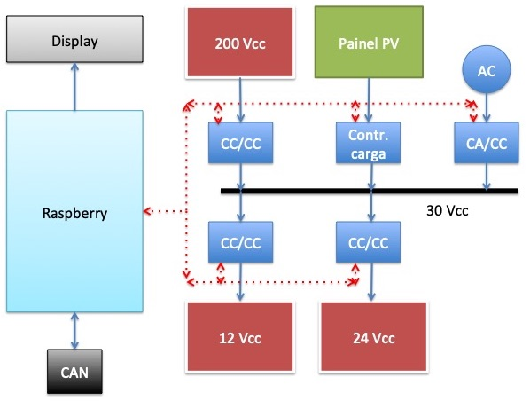
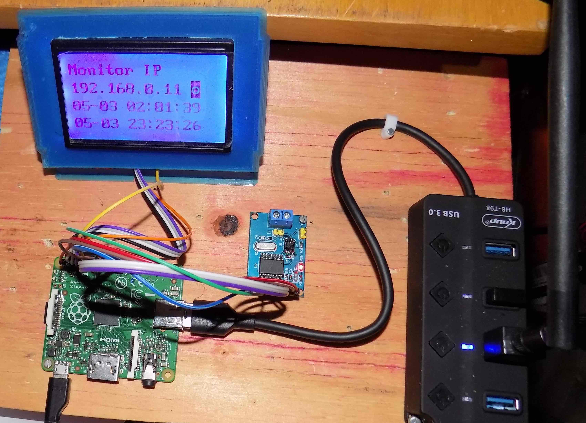

# Sistema de Gerenciamento de Energia 
Rudivels@ maio 2020

Raspberry com CANBUS para o BRElétrico

Pasta local 
`/Users/rudi/src/BrEletrica/rasp_can`

# 1. Apresentação
O sistema de gerenciamento de energia do BRElétrica tem a função de monitorar o consumo de energia de todos os subsistemas do veículo e gerenciar a transferência de energia entre os sistemas de armazenamento e a rede de abastecimento e assim calcular a automia do veículo.

Para isso o *Energy Management System* (EMS) precisa monitorar a partir dos dados transmitidas no barramento CAN o consumo de todos os subsistemas do veículo e interagir com os sistemas de armazenamento e abastecimento. 
Exemplo de um EMS pode ser visto na referência [1] 

Devido a essa complexidade a proposta é que este sistema seja implementado num módulo com minicomputador Raspberry com interface para barramento CAN. 

Este módulo também vai de monitorar e controlar o carregamento das baterias de 12v e 24v. O circuito de 12Volts alimenta todos os sistemas elétricas convencionais no veículo como luzes, buzina, instrumentação e tem como armazenador (por enquanto) uma bateria automotiva chumbo ácido convencional. A previsão é de mudar essa bateria para uma tecnologia mais adequado.

O veículo elétrico precisa de um circuito de alimentação de 24 Volts CC para alimentar o rele de força para ligar o circuto de potência em 200 Volts CC da bateria de tração ao Controlador do motor de tração. Não se conseguiu resultados satisfatórios e estáveis com reles de 12 Vcc, e por isso optou-se em instalar um circuito separado. Num futuro todos os circuitos de potência secundário de um carro elétrico podem ser alimentado por este circuito (por exemplo sistema de arrefecimento do motor e condiciomanento do ar).

O módulo EMS pode comandar o carregamento das baterias de 12 e 24 Volts a partir da rede elétrica convencional ou da bateria de tração a partir de um conversor CC-CC.
Outra funcionalidade do ES é de comandar a carga das baterias secundárias a partir de um painel de energia solar fotovolaitico instalado no teto do veículo.


# 2. Diagrama de blocos

Os componentes do sistema de gerenciamento de energia são:

- conversor CC/CC 30-12 para carregar bateria de 12 Vcc 
- conversor CC/CC 30-24 para carregar bateria de 24 Vcc
- conversor CA/CC 220Vca para 30Vcc
- conversor CC/CC 200-30
- barramento de tensão de 30Vcc
- módulo fotovoltaico de 30Vcc com controlador de carga
- Raspberry com interface para barramento CAN
- Display LCD ST7920 128x64

Os componentes são mostrados no diagrama de blocos a seguir.



Nas baterias de 12 e 24 volts devem ser colocados medidores de corrente para medir a corrente que entre e sai. 
O Raspberry comanda todos os conversores CC/CC, CA/CC e controlador de carga do sistema PV e monitora a corrente que eles fornecem por meio de 
conversores ADC baseado no 
[ADS1115](https://www.filipeflop.com/produto/conversor-analogico-digital-4-canais-ads1115/) que estão no barramento I2C do Raspberry. 
Este ADC possui 4 canais e na mesma linha de comunicação I2C podem ser ligados até 4 desses conversores. Ou seja, podem ser monitorados até 16 sinais analógicas pela porta I2C do Raspberry.


# 3. Implementação

## 3.1. Hardware

O elemento central do EMS é um Raspberry com um módulo CAN baseado no MCP2515 que está ligado na sua interface SPI. O datasheet do controlador MCP2515 está [aqui](http://ww1.microchip.com/downloads/en/DeviceDoc/MCP2515-Stand-Alone-CAN-Controller-with-SPI-20001801J.pdf). 
O módulo CAN usado é um módulo que originalmente foi desenvolvido para ser usado no Arduino (<https://www.filipeflop.com/produto/modulo-can-bus-mcp2515-tja1050/>).
Tivemos que adaptar este módulo para ser usado com o Raspberry e em vez de colocar um conversor de nível 3.3v para 5v, optamos em trocar o transciever  TJA1050 para um transciever que tabalha com 3.3v. 


O display ST7920 128x64 foi usado no modo texto conforme documentado no repostório <https://github.com/rudivels/st7920>. Entretanto, para liberar a porta SPI para ser usado pela interface CAN, o display foi ligado nos pinos 3,5,7 e 11 da barra de expansão do Raspberry.

A tabela a seguir mostra a pinagem do Raspberry que pode ser obtido rodando o programa:  

`gpio readall` 


| BCM | wPi |   Name  | Mode | V | Fis|Fis | V | Mode | Name    | wPi | BCM |
|-----|-----|---------|------|---|----|----|---|------|---------|-----|-----|
|     |     |    3.3v |      |   |  1 | 2  |   |      | 5v      |     |     |
|   2 |   8 |   SDA.1 |  OUT | 0 |  3 | 4  |   |      | 5v      |     |     |
|   3 |   9 |   SCL.1 |  OUT | 0 |  5 | 6  |   |      | 0v      |     |     |
|   4 |   7 | GPIO. 7 |  OUT | 0 |  7 | 8  | 1 | ALT0 | TxD     | 15  | 14  |
|     |     |      0v |      |   |  9 | 10 | 1 | ALT0 | RxD     | 16  | 15  |
|  17 |   0 | GPIO. 0 |  OUT | 1 | 11 | 12 | 0 | IN   | GPIO. 1 | 1   | 18  |
|  27 |   2 | GPIO. 2 |   IN | 0 | 13 | 14 |   |      | 0v      |     |     |
|  22 |   3 | GPIO. 3 |   IN | 0 | 15 | 16 | 0 | IN   | GPIO. 4 | 4   | 23  |
|     |     |    3.3v |      |   | 17 | 18 | 0 | IN   | GPIO. 5 | 5   | 24  |
|  10 |  12 |    MOSI | ALT0 | 0 | 19 | 20 |   |      | 0v      |     |     |
|   9 |  13 |    MISO | ALT0 | 0 | 21 | 22 | 0 | IN   | GPIO. 6 | 6   | 25  |
|  11 |  14 |    SCLK | ALT0 | 0 | 23 | 24 | 1 | OUT  | CE0     | 10  | 8   |
|     |     |      0v |      |   | 25 | 26 | 1 | OUT  | CE1     | 11  | 7   |
| BCM | wPi |   Name  | Mode | V | Fis|Fis | V | Mode | Name    | wPi | BCM |

.

A ligação entre o módulo CAN e o Raspberry está mostrada na tabela a seguir.

| Função can | pino can | Função Rasp | pino rasp |
|:---------:|:---------:|:-----------:|:---------:|
| INT       |   1       |  6          |  22       |
| SCK       |   2       |  SCLK       |  23       |
| SI        |   3       |  MOSI       |  19       |
| SO        |   4       |  MISO       |  21       |
| CS        |   5       |  CE0        |  24       |
| GND       |   6       |  GND        |   6       |
| Vcc       |   7       |  5V         |   1       | 

Observação. Quando se ligou pela primeira vez o módulo, não foi conectado o INT do módulo. O módulo funcionou, mas ele consumiu mais de 75% dos recursos do cpu do Raspberry, que foi verificado com o programa `top`. 
Com a ligação do pino INT no GPIO.6 do Raspberry o uso dos recursos do CPU baixou para menos de 1% sem comunicação no barramento.
 
A figura a seguir mostra a montagem do Raspberry com display e MCP2515




## 3.2. Configuração do Raspberry

A configuração do Raspberry foi baseado num artigo em <https://www.beyondlogic.org/adding-can-controller-area-network-to-the-raspberry-pi/>
que apresenta um roteiro para ligar o minicomputar ao módulo MCP2515.

Para instalar o tree overlay no Raspberry deve se adicionar o seguinte linha ao arquivo `/boot/config.txt` :

```
dtoverlay=mcp2515-can0,oscillator=8000000,interrupt=25 
```

Para conferir se o módulo can foi corretamente carregado pelo Kernel durante o boot e inicializada pela pela porta SPI pode se executar o comando:
 
`dmesg | grep mcp`

A seguinte mensagem indica que o mcp2512 foi inicializado com sucesso:
 
```
[   21.653929] mcp251x spi0.0 can0: MCP2515 successfully initialized.
```

Uma vez carregado o driver corretamente pelo sistema você pode ativar manualmente a interface CAN pelo comando usando:

`sudo /sbin/ip link set can0 up type can bitrate 500000`
 
Você pode verificar a configuração do link com 

`ifconfig`


Para ativar a interface automaticamente durante o boot os seguintes linhas de código tem que ser adicionado no arquivo 

`/etc/network/interfaces` : 

```auto can0
iface can0 inet manual
    pre-up /sbin/ip link set can0 type can bitrate 500000 triple-sampling on restart-ms 100
    up /sbin/ifconfig can0 up
    down /sbin/ifconfig can0 down
```

Há uma questões sobre a capacidade de velocidade leitura e processamento do controlador e do Raspberry.
Uma maneira simples é verificar é monitorar a carga do CPU usando o comando `top` e verifcar a quantidade de pacotes descartados ou com erro usando o `ifconfig`.

Para verificar isso gerou-se uma mensagem no barramento com por exemplo um microcontrolador com interface CAN. No nosso exemplo, madando um pacote com uma mensagem de 4 bytes de dados a cada 1 milisegundo, deu uma carga de menos de 14% de CPU e nenhuma perda de pacote. 
Ao mudar a velocidade para um pacoto a cada 1 microsegundo a carga de processamento chegou 65% com alguns erros na recepção. 
Para um velocidade de clock de 500.000 hz pode se calcular teoricamente uma taxa efetiva de transmissão de dados de :

500.000 / (tamanho de bits do pacto 31) = 16129 pacotes por segundo.
Cada pacote com 4 bytes utis dá 64.500 bytes por segundo.


# 4. Programa de EMS

Máquina de estado do EMS.

- Monitorando consumo da bateria de tração (corrente e tensão);
- Monitorando perfil de deslocamento; 
- Monitorando consumo baterias secundários.

Implementando algoritmo de calculo de autonomia.


# 5. Bibliografia

1 ) S. Mohd, S. A. Zulkifli, R. G. A. Rangkuti, M. Ovinis and N. Saad, "Electric vehicle energy management system using National Instruments' CompactRIO and LabVIEW," 2013 IEEE International Conference on Smart Instrumentation, Measurement and Applications (ICSIMA), Kuala Lumpur, 2013, pp. 1-6.  <DOI:10.1109/ICSIMA.2013.6717928>


[volta](https://github.com/rudivels)